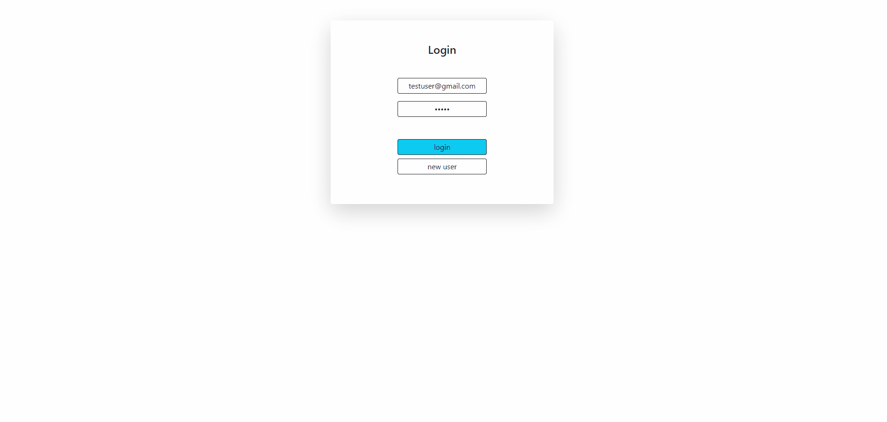

# README

Event Calendar criado com js, html/css, node.js, mongo 

 
    <a href="#sobre">Sobre</a>
    <a href="#funcionalidades">Funcionalidades</a>
    <a href="#tecnologias">Tecnologias</a>
    <a href="#testar">Testar</a>
    <a href="#Autor">Autor</a>
     
 

 # Sobre
 

 
Sistema web de calendário de eventos: aonde o usúario cria o evento, mandando a requisição para o backend e assim salvando o mesmo. Projeto com o foco em desenvolver um sistema com arquitetura REST, que utilize meus conhecimentos de frontend e backend

 
Você pode usar a minha conta teste ou ate mesmo criar sua própria conta

    <ul>
        <li>Login: testUser@gmail.com</li>
         <li>Senha: 12345</li>
 </ul>

 
O site está 100% em inglês para treinar o meu desenvolvimento com projetos em inglês

 # Funcionalidades 
<ul>
    <li>Cadastro de usuário</li>
    <li>Login para acesso ao sistema</li>
    <li>Adição de eventos</li>
    <li>Edição de eventos</li>
    <li>Remoção de eventos</li>
    <li>Listagem de eventos</li>
 </ul>

 # Tecnologias
 <ul>
    <li>HTML</li>
    <li>CSS</li>
    <li>Javascript</li>
    <li>Bootstrap</li>
    <li>Node.js</li>
    <li>MongoDB</li>
 </ul>

 
 # testar
 <ol>
    <li>Realize o download do repositório na sua máquina</li>
    <li>Abra a pasta na IDE da sua prefêrencia, como vscode e etc</li>
    <li>Digite no terminal "node app"</li>
    <li>Abra o seu navegador e digite "http://localhost:5000")</li>
    <li>Pronto! só testar</li>
 </ol>

 # Autor

 <ul>
    <li>Yutaro Negi</li>
    <li><a href="https://www.linkedin.com/in/yutaronegi/">Linkedin</a></li>
    <li>(11) 94194-5061</li>
    <li>souza_yutaro@hotmail.com</li>
 </ul>

